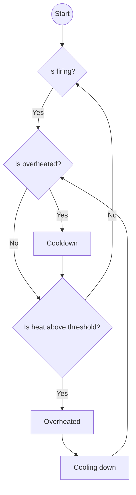
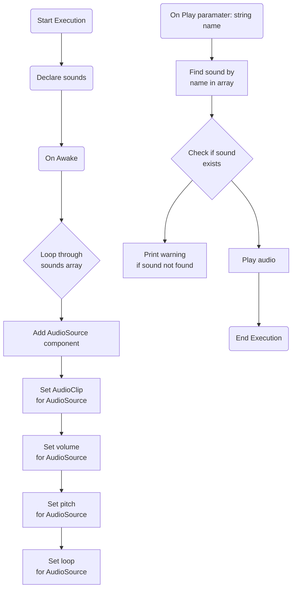
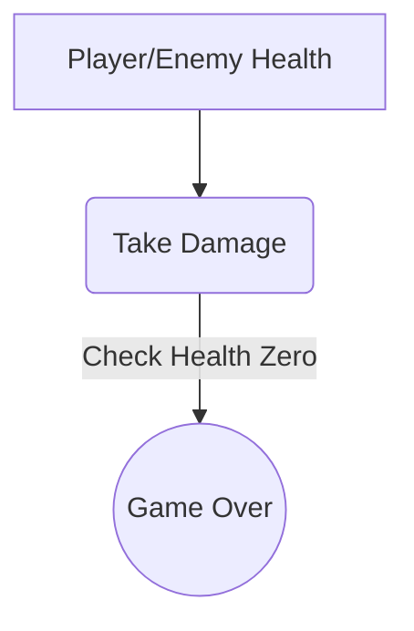
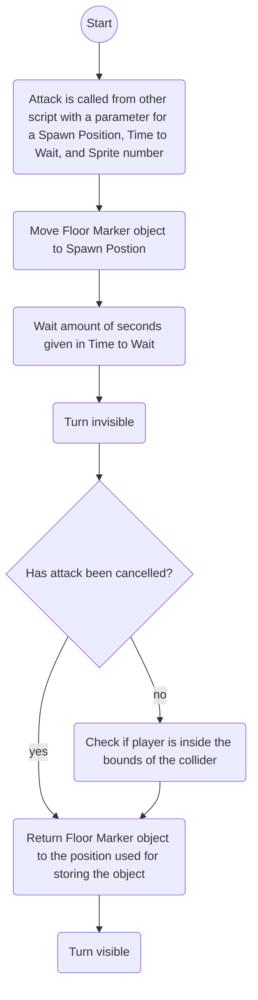

# Project_Kaiju

# Geproduceerde Game Onderdelen

Bjorn:
* [Waypoint Manager](https://github.com/Bjorn-O/Project_Kaiju/blob/Develop/Unity%20Project-%20Kaiju/Assets/Scripts/Systems/Waypoints/WayPointManager.cs)
* [Waypoint](https://github.com/Bjorn-O/Project_Kaiju/blob/Develop/Unity%20Project-%20Kaiju/Assets/Scripts/Systems/Waypoints/Waypoint%20Types/Waypoint.cs)
* [Bezier Paths](https://github.com/Bjorn-O/Project_Kaiju/blob/Develop/Unity%20Project-%20Kaiju/Assets/Scripts/Systems/Waypoints/BezierPath.cs)
* [RailMovement](https://github.com/Bjorn-O/Project_Kaiju/blob/Develop/Unity%20Project-%20Kaiju/Assets/Scripts/Systems/Waypoints/RailMovement.cs)
* [Crosshair Movement](https://github.com/Bjorn-O/Project_Kaiju/blob/Develop/Unity%20Project-%20Kaiju/Assets/Scripts/Gameplay/Gun/CrosshairMovement.cs)
* [Gun Rotation](https://github.com/Bjorn-O/Project_Kaiju/blob/Develop/Unity%20Project-%20Kaiju/Assets/Scripts/Gameplay/Gun/LookAtCrosshair.cs)
* [PlayerManager](https://github.com/Bjorn-O/Project_Kaiju/blob/Develop/Unity%20Project-%20Kaiju/Assets/Scripts/Systems/Networking/PlayerManager.cs) [Unused]
* [ClientManager](https://github.com/Bjorn-O/Project_Kaiju/blob/Develop/Unity%20Project-%20Kaiju/Assets/Scripts/Systems/Networking/ClientManager.cs) [Unused]
* [TentacleAnimationManager](https://github.com/Bjorn-O/Project_Kaiju/blob/Develop/Unity%20Project-%20Kaiju/Assets/Scripts/Enemies/TentacleAnimatorManager.cs)

Riley:
* [overheat mechanic](https://github.com/Bjorn-O/Project_Kaiju/tree/Develop/Unity%20Project-%20Kaiju/Assets/Scripts/Gameplay/Ammo)
* [audio systeem](https://github.com/Bjorn-O/Project_Kaiju/tree/Develop/Unity%20Project-%20Kaiju/Assets/Scripts/Systems/Audio)
* [Health system](https://github.com/Bjorn-O/Project_Kaiju/tree/Develop/Unity%20Project-%20Kaiju/Assets/Scripts/Gameplay/Health)

Jori:
* Link toevoegen [Attack systeem]() [Unused]
* Link toevoegen [Main menu]() [Unused]

# overheat mechanic

De overheat feature zorgt er voor dat de game gebalanced door de player niet oneindig te laten schieten
Om het telaten werken voeg je het script toe aan de gun en in de shooting script moet bij de shooting function de fire function hebben ook zijn er 2 events die er invooked worden wanneer hij overheated is en wanneer hij weer afgekoeld is je lan ook in de inspecter de floats van de heatthreshold aanpassen om het spel anders te blanceren

### flowchart voor overheat mechanic:

# Audio system

De audio systeem zorgt voor alle audio in de game
Je kan in de inspecter audioclips in de array van sounds op de plus klikken je kan dan een clip er aan toevoegen een naam geven en het volume van de clip aanpassen
1.	De sounds array stamt af van een costum class genaamd Sound die hoef je nergens aan toe te voegen, die script zorgt voor de array van clips zodat ze allemaal een naam krijgen en andere vraiable kan aanpassen

2.	audiomanager script toevoegen aan een gameobject. om een sound af te laten spelen moet je in een ander script waar je het geluidje van wil laten afspelen de Play(string name) functie aanroepen en de parameter moet de naam zijn van de sound die je hebt toegevoegd dus niet de audioclips naam zelf maar de naam die je hebt toegevoegd.

### flowchart voor Audio manager:

# Health system

Het gezondheidssysteem biedt functionaliteit om de gezondheid van spelers en vijanden in een spel te beheren. Het stelt je in staat om gezondheidswaarden bij te houden en bij te werken, events te activeren bij veranderingen in de gezondheid de health system bestaat uit 3 scripts: playerhealth enemy health en IDamage
de health scripts voor enemy en player houden hun currenthealth bij en de Idamage in een interface die een takedamage functie heeft met een damage parameter

### flowchart voor overheat mechanic:

# Floor Marker system

Als een floor marker nodig is kan een script de FloorMarketAttack coroutine starten. Deze functie heeft 3 parameters: Vector3 spawnPosition, float timeToWait, int sprite.

spawnPosition is gebruikt om de positie waar de Floor Marker tevoorschijn komt, timeToWait is gebruikt om de tijd tussen het spawnen van de Floor Marker en de schade toe te passen en sprite wordt gebruikt om te bepalen welke sprite en welke hitbox gebruikt moet worden. De Floor Marker kan geannuleerd worden als het nodig is, de aanval wordt dan geannuleerd nadat timeToWait voorbij is.

Als de aanval niet geannuleerd is dan word er gecheckt of de speler in de hitbox zit en dan wordt schade toegepast als het nodig is.

### flowchart voor floor market system:

