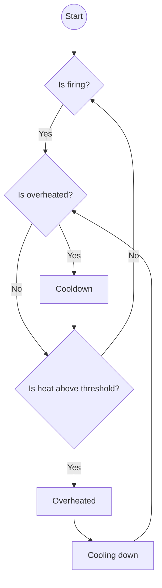
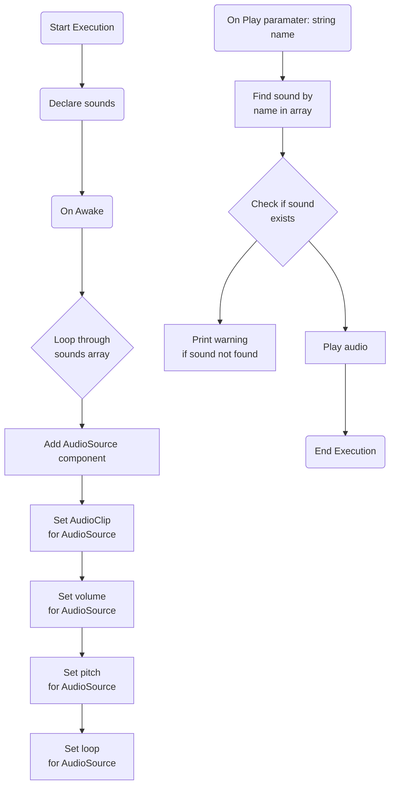
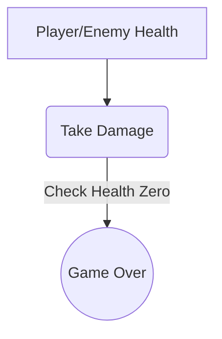

# Project_Kaiju

## geproduceerde onderdelen

Student Riley
* [Overheat mechanic](https://github.com/Bjorn-O/Project_Kaiju/tree/Develop/Unity%20Project-%20Kaiju/Assets/Scripts/Gameplay/Ammo)
* [AudioManager](https://github.com/Bjorn-O/Project_Kaiju/tree/Develop/Unity%20Project-%20Kaiju/Assets/Scripts/Systems/Audio)
* [Health system](https://github.com/Bjorn-O/Project_Kaiju/tree/Develop/Unity%20Project-%20Kaiju/Assets/Scripts/Gameplay/Health)

##	Overheat mechanic

De overheat feature zorgt er voor dat de game gebalanced door de player niet oneindig te laten schieten
Om het telaten werken voeg je het script toe aan de gun en in de shooting script moet bij de shooting function de fire function hebben ook zijn er 2 events die er invooked worden wanneer hij overheated is en wanneer hij weer afgekoeld is je lan ook in de inspecter de floats van de heatthreshold aanpassen om het spel anders te blanceren

## Flowchart voor overheat mechanic

## Audio systeem

De audio systeem zorgt voor alle audio in de game
Je kan in de inspecter audioclips in de array van sounds op de plus klikken je kan dan een clip er aan toevoegen een naam geven en het volume van de clip aanpassen

1.	De sounds array stamt af van een costum class genaamd Sound die hoef je nergens aan toe te voegen, die script zorgt voor de array van clips zodat ze allemaal een naam krijgen en andere vraiable kan aanpassen

2.	audiomanager script toevoegen aan een gameobject. om een sound af te laten spelen moet je in een ander script waar je het geluidje van wil laten afspelen de Play(string name) functie aanroepen en de parameter moet de naam zijn van de sound die je hebt toegevoegd dus niet de audioclips naam zelf maar de naam die je hebt toegevoegd en als je per ongeluk een typo maakt in de parameter dan geeft hij een debug. Logerror aan met de naam van de sound

## flowchart voor audioManager

## HealthSystem
Overzicht
Het gezondheidssysteem biedt functionaliteit om de gezondheid van spelers en vijanden in een spel te beheren. Het stelt je in staat om gezondheidswaarden bij te houden en bij te werken, gebeurtenissen te activeren bij veranderingen in de gezondheid

### Componenten
Het gezondheidssysteem bestaat uit de volgende componenten:

1.	PlayerHealth: Een script dat aan het spelerobject wordt toegevoegd en de gezondheid van de speler beheert. 

2.	EnemyHealth: Een script dat aan enemy wordt toegevoegd en de gezondheid van de vijand beheert. Het bevat methoden om schade te nemen.

3.	 IDamage: een interface die een basic damage functie doorgeeft met een parameter om de amount van de damage te bepalen en dei doorgeeft aan de enemy en player

### Gebruik
Voeg je enemy of player health toe aan je player of enemy prefab.
Configureer de startgezondheid en andere eigenschappen in de inspecter.
En bij attack scripts van de player en enemy moet de damage function worden aangeroept worden en een damage paramater doorgeven

