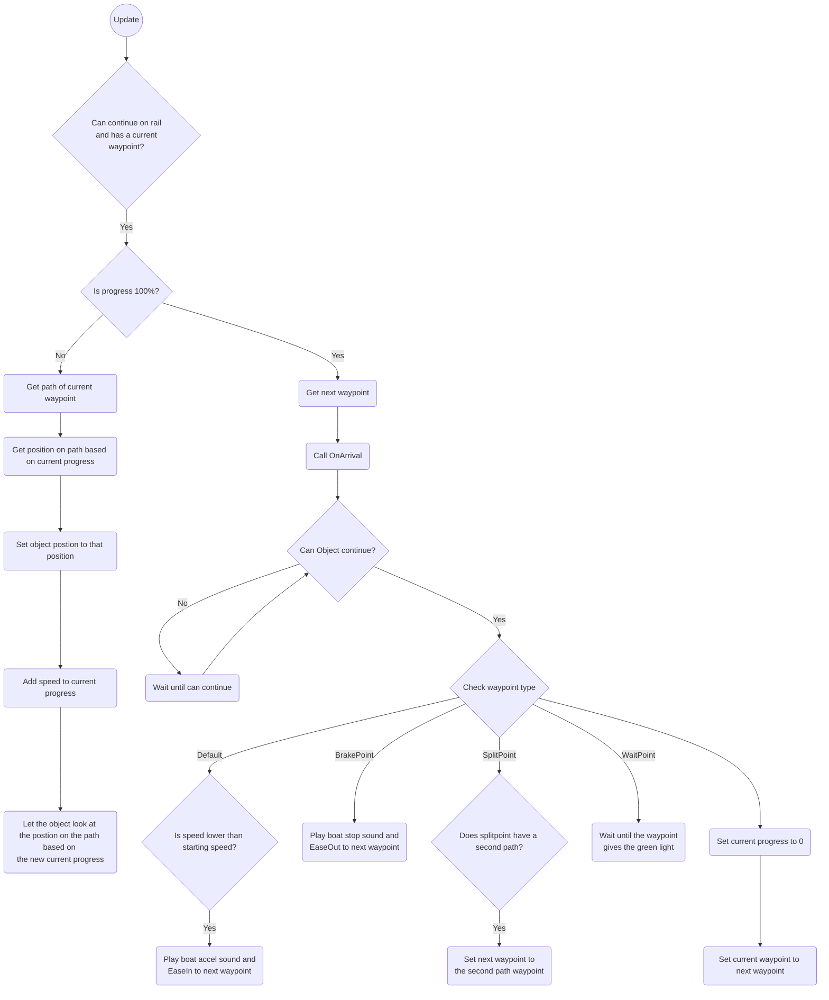
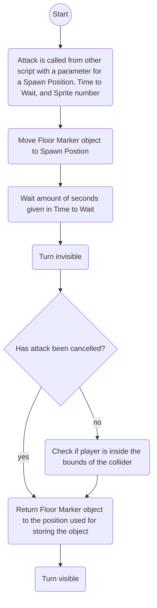
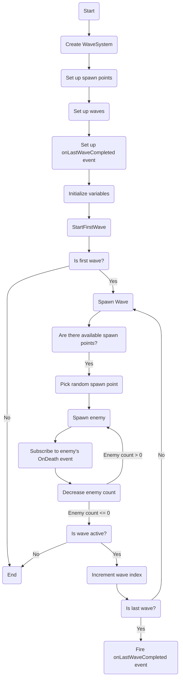
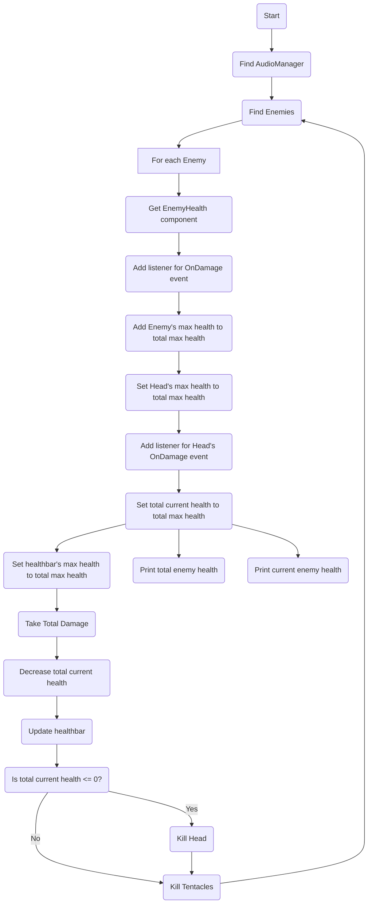
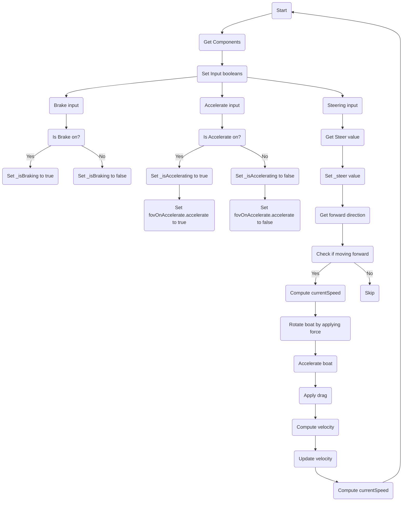
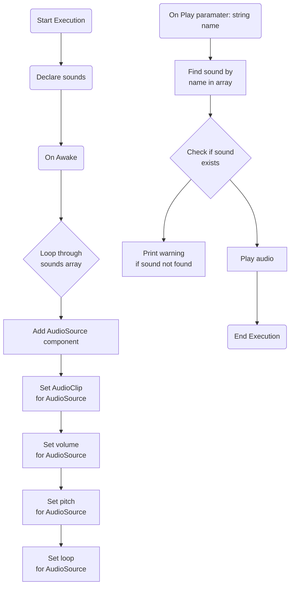
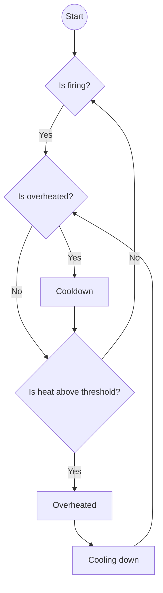

# Project_Kaiju


# Geproduceerde Game Onderdelen

Bjorn:
* [Waypoint Manager](https://github.com/Bjorn-O/Project_Kaiju/blob/Develop/Unity%20Project-%20Kaiju/Assets/Scripts/Systems/Waypoints/WayPointManager.cs)
* [Waypoint](https://github.com/Bjorn-O/Project_Kaiju/blob/Develop/Unity%20Project-%20Kaiju/Assets/Scripts/Systems/Waypoints/Waypoint%20Types/Waypoint.cs)
* [Bezier Paths](https://github.com/Bjorn-O/Project_Kaiju/blob/Develop/Unity%20Project-%20Kaiju/Assets/Scripts/Systems/Waypoints/BezierPath.cs)
* [RailMovement](https://github.com/Bjorn-O/Project_Kaiju/blob/Develop/Unity%20Project-%20Kaiju/Assets/Scripts/Systems/Waypoints/RailMovement.cs)
* [Crosshair Movement](https://github.com/Bjorn-O/Project_Kaiju/blob/Develop/Unity%20Project-%20Kaiju/Assets/Scripts/Gameplay/Gun/CrosshairMovement.cs)
* [Gun Rotation](https://github.com/Bjorn-O/Project_Kaiju/blob/Develop/Unity%20Project-%20Kaiju/Assets/Scripts/Gameplay/Gun/LookAtCrosshair.cs)
* [TentacleAnimationManager](https://github.com/Bjorn-O/Project_Kaiju/blob/Develop/Unity%20Project-%20Kaiju/Assets/Scripts/Enemies/TentacleAnimatorManager.cs)

* [PlayerManager](https://github.com/Bjorn-O/Project_Kaiju/blob/Develop/Unity%20Project-%20Kaiju/Assets/Scripts/Systems/Networking/PlayerManager.cs) [Unused]
* [ClientManager](https://github.com/Bjorn-O/Project_Kaiju/blob/Develop/Unity%20Project-%20Kaiju/Assets/Scripts/Systems/Networking/ClientManager.cs) [Unused]

Jaimy:
* [WaveSystem](https://github.com/Bjorn-O/Project_Kaiju/blob/Develop/Unity%20Project-%20Kaiju/Assets/WaveSystem.cs)
* [Recoil](https://github.com/Bjorn-O/Project_Kaiju/blob/Develop/Unity%20Project-%20Kaiju/Assets/Scripts/Gameplay/Gun/Recoil.cs)
* [Hitmarker](https://github.com/Bjorn-O/Project_Kaiju/blob/Develop/Unity%20Project-%20Kaiju/Assets/Scripts/Gameplay/Gun/Hitmarker.cs)
* [MonsterTotal Health](https://github.com/Bjorn-O/Project_Kaiju/blob/Develop/Unity%20Project-%20Kaiju/Assets/Scripts/Gameplay/Health/MonsterTotalHealh.cs)
* [Healthbar](https://github.com/Bjorn-O/Project_Kaiju/blob/Develop/Unity%20Project-%20Kaiju/Assets/Scripts/Gameplay/Health/Healthbar.cs)

* [Ship movement](https://github.com/Bjorn-O/Project_Kaiju/blob/Develop/Unity%20Project-%20Kaiju/Assets/Scripts/Gameplay/Boat/ShipMovement.cs) [Unused]
* [Steer input](https://github.com/Bjorn-O/Project_Kaiju/blob/Develop/Unity%20Project-%20Kaiju/Assets/Scripts/Gameplay/Boat/SteerInput.cs) [Unused]
* [FovOnAccelerate](https://github.com/Bjorn-O/Project_Kaiju/blob/Develop/Unity%20Project-%20Kaiju/Assets/Scripts/Systems/FovOnAccelerate.cs) [Unused]

Riley:
* [Audio systeem](https://github.com/Bjorn-O/Project_Kaiju/tree/Develop/Unity%20Project-%20Kaiju/Assets/Scripts/Systems/Audio) + Jaimy
* [Health system](https://github.com/Bjorn-O/Project_Kaiju/tree/Develop/Unity%20Project-%20Kaiju/Assets/Scripts/Gameplay/Health) + Jaimy

* [Overheat mechanic](https://github.com/Bjorn-O/Project_Kaiju/tree/Develop/Unity%20Project-%20Kaiju/Assets/Scripts/Gameplay/Ammo) [Unused]

Jori:
* [Attack systeem](https://github.com/Bjorn-O/Project_Kaiju/blob/Develop/Unity%20Project-%20Kaiju/Assets/Scripts/AI/AttackSystem.cs) [Unused]
* [Main menu](https://github.com/Bjorn-O/Project_Kaiju/blob/Develop/Unity%20Project-%20Kaiju/Assets/Scripts/Systems/UI/ButtonManager.cs) [Unused]

# Waypoint System

Het Waypoint system is een complex system dat bestaat uit 4 classes, de Waypoint Manager, de Waypoint en variaties, de Bezier Path en de Railmovement. Gezamelijk maakt het voor een flexibel en dynamisch systeem om de speler door het level te begeleiden. De Waypoint Manager is de singleton die aan het hoofd van alles zit, die roept de Waypoints aan die de fysieke punten zijn in het level om daarna samen te komen in de Bezier Paths, die de wiskunden doen voor de gladde bochten. Uiteindelijk hebben we de RailMovement die via deze structuur alleen nieuwe posities aanvraagt en behaviour afspeelt liggend aan wat voor point hij op aankomt. 



# Gun Aim

De Gun Aim systeem werkt met twee componenten en een camera-space Canvas. Het is crosshair focused, dus het punt op de canvas is het punt het wapen naar wijst. Door de camera te bewegen naar links en rechts kunnen we dus een gun-rotatie verder de hoeken in emuleren. Gezamelijk met een gelimiteerde breedte en hoogte waarin de speler zijn crosshair kan bewegen, creëert het 3 speelvelden waarin je de encounters kan ontwerpen. 

# Networking [Player Manager & Client Manager]

De Player Manager is een Singleton die bijhoud hoeveel spelers der verbonden zijn aan de host. Eens de host geopend is kan hij de verschillende clients verdelen in de rollen die beschkibaar zijn. Daarna zet het de juiste Netwerk Objecten met de juiste eigenaars.

```mermaid
flowchart TD;
  idStart([Hosting started])-->idGiveShip{Give host ship ownership};
  idGiveShip-->idCheckOcc{Every occupation filled?};
  idGunReq([Gun ownership request])-->idCheckHost{Is player the host?};
  idCheckHost-->|No|idGiveGun[Give player gun ownership];
  idGiveGun-->idCheckOcc;
  idSpotlightReq([Spotlight ownership request])-->idCheckHost2{Is player the host?};
  idCheckHost2-->|No|idGiveSpotlight[Give player spotlight ownership];
  idGiveSpotlight-->idCheckOcc;
  idCheckOcc-->|Yes|idEnd([Ready up every player]);
  ```
  

# Health system

Het gezondheidssysteem biedt functionaliteit om de gezondheid van spelers en vijanden in een spel te beheren. Het stelt je in staat om gezondheidswaarden bij te houden en bij te werken, events te activeren bij veranderingen in de gezondheid de health system bestaat uit 3 scripts: playerhealth enemy health en IDamage
de health scripts voor enemy en player houden hun currenthealth bij en de Idamage in een interface die een takedamage functie heeft met een damage parameter


### flowchart voor overheat mechanic:
```mermaid

graph TD
    A[Player/Enemy Health] -->B(Take Damage)
    B -->|Check Health Zero| C((Game Over))

```

# Floor Marker system

Als een floor marker nodig is kan een script de FloorMarketAttack coroutine starten. Deze functie heeft 3 parameters: Vector3 spawnPosition, float timeToWait, int sprite.

spawnPosition is gebruikt om de positie waar de Floor Marker tevoorschijn komt, timeToWait is gebruikt om de tijd tussen het spawnen van de Floor Marker en de schade toe te passen en sprite wordt gebruikt om te bepalen welke sprite en welke hitbox gebruikt moet worden. De Floor Marker kan geannuleerd worden als het nodig is, de aanval wordt dan geannuleerd nadat timeToWait voorbij is.

Als de aanval niet geannuleerd is dan word er gecheckt of de speler in de hitbox zit en dan wordt schade toegepast als het nodig is.

### flowchart voor floor market system:



# Wave System
De wave Systeem is gemaakt zodat je makkelijk via een list nieuwe waves kunt aan maken en de tegenstanders op verschillende spawn points kunt laten spawnen. aan het einde van de laatste wave kun je met events een functie aan roepen ( nu gebruiken wij dit om naar de volgende waypoint te gaan)

### flowchart voor Wave System


# Monster Total Health
Deze script wordt gebruikt om alle tentakels van de final boss hun health samen te voegen om te monsters total health te bepalen. het is ook geschreven dat als je de tentakels aanvalt gaat de totaal health ook omlaag en dat is ook sneller dan alleen het hoofd te schieten.

### flowchart voor monster total health


# Ship Movement [Unused]
Deze script is voor de gescrapte boot/sheep movement mechanics. De boot wordt van achteren naar voren geduwd om realistische sheep fysica te proberen emuleren. Ook heeft de boot een "Pivot point" die gebruikt wordt om em te sturen. dit doet ie door de boot in de tegengestelde richting van waar je naartoe wilt te duwen. de achterkant van het schip/boot draait dan in de richting dat de spelen naar toe wilt.
### flowchart voor ship movement


# Audio system

De audio systeem zorgt voor alle audio in de game
Je kan in de inspecter audioclips in de array van sounds op de plus klikken je kan dan een clip er aan toevoegen een naam geven en het volume van de clip aanpassen
1.	De sounds array stamt af van een costum class genaamd Sound die hoef je nergens aan toe te voegen, die script zorgt voor de array van clips zodat ze allemaal een naam krijgen en andere vraiable kan aanpassen

2.	audiomanager script toevoegen aan een gameobject. om een sound af te laten spelen moet je in een ander script waar je het geluidje van wil laten afspelen de Play(string name) functie aanroepen en de parameter moet de naam zijn van de sound die je hebt toegevoegd dus niet de audioclips naam zelf maar de naam die je hebt toegevoegd.


### flowchart voor Audio manager:


# Overheat Mechanic

De overheat feature zorgt er voor dat de game gebalanced door de player niet oneindig te laten schieten
Om het telaten werken voeg je het script toe aan de gun en in de shooting script moet bij de shooting function de fire function hebben ook zijn er 2 events die er invooked worden wanneer hij overheated is en wanneer hij weer afgekoeld is je lan ook in de inspecter de floats van de heatthreshold aanpassen om het spel anders te blanceren


### flowchart voor overheat mechanic:

